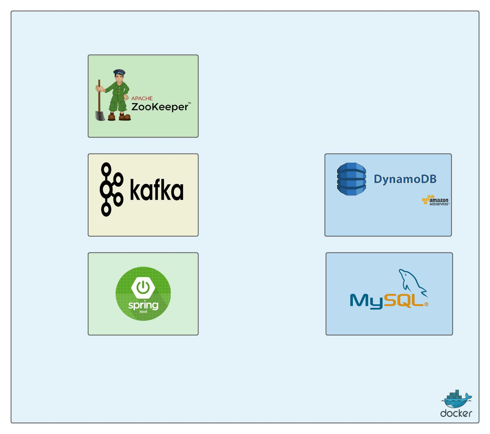

# Paying with a tomato


## About

Tomato challenge.


## Pre-requisites

Docker desktop


## How to run

#### start containers

```bash
cd domaintransactions
docker-compose -f docker-compose.yml up
```

#### stop containers

```bash
cd domaintransactions
docker-compose -f docker-compose.yml down
```


## System Design


## Deployment workflow


## Deployment design




## Code coverage report

| com.tomatopay | 91% (11/12) | 90% (29/32) | 94% (81/86) |
| ------------- | ----------- | ----------- | ----------- |

